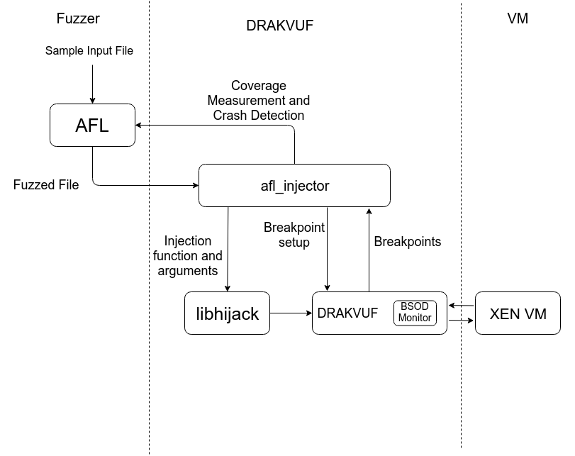

# Project: Operating System Fuzzing using Hypervisor 
## Introduction: 
This project aims at fuzzing an operating system kernel using hypervisor. Project [**Drakvuf**](https://drakvuf.com) provides a framework for stealthy, blackbox malware analysis. It also provides a way to inject processes in guest VMs. Building on top of it we developed libhijack that can inject arbitrary function calls inside the guest VM. Using this we can call various different function calls that are present in the loaded modules in the function (drivers or internal functions). We can use this feature to thus fuzz the drivers and operating system kernel without presence of an agent inside the guest. Also, this approach does not need the guest OS to be emulated therefore allowing full performance benefit of hypervisor.

### Link to the [repository](https://github.com/the-elves/drakvuf/)

### Instruction to build and run are [here](https://the-elves.github.io/drakvuf/)

### Approach taken
-  Drakvuf's libinjector provided the code required for injecting arbitrary functions in the guest OS. We built libhijack on top of libinjector which takes an arbitrary function name and argument values for those functions and make function call. 
-  We then proceeded to build a naive fuzzer that selects a random function from a list of candidate functions, generates random values for its arguments and injects this function.
-  Next we built *afl_injector.cpp* that can be interfaced with the AFL. At this stage AFL could only run the program
-  In final stages we built precise coverage measurement required by afl to generate new inputs. 



### Kernel Virtual Address Shadowing (KVA Shadow)
-  We have to wait for the target process to be scheduled to inject functions into it. We identify the process scheduling event by load to CR3 register. After CR3 loaded we check if the pid is equal to target pid that we want to hijack. We faced an issue at this point. 
-  Our target process was scheduled with two values in CR3 register. And when process was scheduled with one of these CR3s our the address translation of injection function resulted to 0. This was very clearly an problem.
-  We narrowed down the problem to Kernel Virtual Address Shadow (KVAS). It is windows implementation of Kernel Page Table Isolation. It is an mitigation for speculative execution attacks. Under this mitigation the two page tables are maintained one of usermode and other for kernel space. These address spaces are characterized by two CR3 values. Out of these, user page tables won't have the the kernel mapped into address space. Therefore, the address translation for our target function cannot be completed  
-  During debugging we had to figure out the exact implementation of KVA Shadow and in turn many of the windows internals of windows processes. For each logical process the windows kernel maintains KPCR structure (Kernel Processor Control Region). This structure contains the pointer to the kernel part of the process. It is stored in the KPROCESS structure. KPROCESS structure has fields *DirectoryPageTable* and *UserDirectoryPageTable* which are base addresses of two page tables discussed above. We added the the checks for checking that process is scheduled using kernel *DirectoryPageTable*

### AFL
-  American fuzzy lop (AFL) is popular fuzzing tool among the security community. AFL is credited with many bugs and CVEs. 
-  We had to interface AFL with the libhijack and for that I had to understand the internals of AFL.
-  Interfacing AFL and afl_injector.cpp was straight forward. I replicated the steps that AFL does through instrumentation. AFL runs in a process started by *afl-fuzz*. *afl-fuzz*, among other things, sets up a shared memory, sets the id of the shared memory in an env var \_\_AFL\_SHM\_ID. *afl-fuzz* also creates two pipes and copies them to file descriptors 198(command) and 199(status).
-  *afl-fuzz* then forks and from the child calls execve for instrumented target program. In the target program AFL adds instrumentation at the beginning of the program that reads the SHM\_ID and attaches to it. Then the target program executes an infinite loop. In the loop
```
while(true)
{
   block on read from FD 198
   pid = fork()
   if(pid == 0)
   {
      // In child
         break; // Therefore continue executing rest of the program
   }
   else
   {
      //In parent
      status = waitpid(pid);
      write(199, status);
   }
}
```
We built this behaviour in afl_injector.cpp. 

### AFL path coverage measurement
-  AFL uses the shared memory discussed before to record path information. At every branch instruction, AFL instruments the following code 
```
   cur_location = <compile-time-random>
   shm[cur_location ^ prev_location]++;
   prev_location = cur_location >> 1;
```
The right shift operation ties the cur_location and prev_location together. Thus afl records the path information. 
-  AFL records path information by instrumenting the branch instructions. We did not have a method of instrumenting the kernel of guest OS. We tried different approaches for recording the path information. For e.g. 
   *  We realized that since a typical kernel driver calls a lot of functions. Therefore a sequence of functions map to a path almost uniquely. We breakpoint all the functions called by a the driver. And assign a cur_location to every function randomly.
   *  We also, unsuccessfully tried to use intel processor trace.
   *  More precisely, we used capstone to measure path information. We break point at the entry of the target function. We disassemble the target function entry till we find first branch/call instruction and we set a break point for it.
   *  When we arrive at that breakpoint we calculate the target and set the breakpoint for the branch target and the fall through instruction. At those breakpoints we update the shared memory map of afl.
   
### AFL Dictionary
-  AFL takes as sample input a json file.
-  There are many keys and values that the fuzzer need not modify. For eg. the keyword "INTEGER" or keyword "STRING". AFL provides a feature, dictionaries, that lets us do just that. 
-  We built the dictionary with the keys and values that are constant to avoid spurious crashes

## Important commits:
-  [95ae6b6](https://github.com/the-elves/drakvuf/commit/95ae6b644be5b3d2518c66636b5b3fc9747b0757): This commit completes setup of libhijacker, 
   1. libhijacker is provided a function name and the rekall profile of the module in which the function is present.
   2. libhijacker first determines the address of function 
   3. libhijacker hijacker waits for a process to be scheduled
   4. When scheduled, 
      1. It hijacks the control flow of the process 
      2. Saves the register state of the process
   5. Makes a function call
   6. After returning from function call
      1. It restores the saved state
      2. Resumes normal execution of the process
   7. All of this is implemented in src/libhijack/* and src/ozzer.cpp
-   [3d755b1](https://github.com/the-elves/drakvuf/commit/3d755b1569d890e8ea06ed69e83fca78b463f19a): 
    1. Now libhijacker also take arguments in json format.
    2. Before calling the function libhijacker parses the arguments from json to format required by drakvuf's libinjector and sets up the stack
    3. Calls the function
    4. After returning restores the register state. 
    5. Drakvuf's Blue Screen of Death Monitor, (BSODMon) is called when guest bsods. In this commit bsod is modified to report the crashing input
    6. We need to hijack the target process in kernel mode. Kernel Virtual Adress (KVA) Shaddowing is windows implementation of kernel page table isolation. It maintains two DTBs for translation, user DTB and kernel DTB. In this commit checks were added to differentiate between these two DTBs
    7. All of this is implemented in src/libhijack/* and src/ozzer.cpp
-   [79504d4](https://github.com/the-elves/drakvuf/commit/79504d47cc54e9499a9cdec0614ff6064b15c70d):
    1. Integrated this with AFL by mannually coding the things that afl does by instrumentation, as following
       1. AFL instruments target to start do some initialization and running in infinite loop
       2. In loop it expects the program to wait for comon on file descriptor 198
       3. Once it receives the command, the program should fork
          - Child should break and execute the program
          - Parent should wait for child to finish executing, and report its status back to AFL
          - Parent then repeats step 2
    2. Work mentioned here is done in afl_injector.cpp
-  [eed6284](https://github.com/the-elves/drakvuf/commit/eed6284ec352b25a7c2d8efcc7914c1e62a2c152):
      1. AFL performs coverage guided fuzzing. i.e. It measures path coverage by instrumenting the branch instructions. 
      2. AFL performs coverage measurement by either instrumenting or running the program under modified qemu. both of these options were not possible for us.
      3. We used capstone to accomplish this task for us. From the injection function we read instructions and inserted breakpoints at branch instructions instructions and call instructions. 
      4. At those respective breakpoints we perform the coverage measurement and place breakpoints at both, the branch/call target and at the fall through location of the branch.
-  [d2fe545](https://github.com/the-elves/drakvuf/commit/d2fe545c4507bc61894d229ab6ab655007f92c78): This is the final gsoc commit

## TODO
-  We have a proof of concept OS fuzzer using hypervisor but there are many spurious crashes that can be avoided. Investigating and implementing strategies to avoid such crashes is to be done in future. 
-  Currently, wait for loading CR3 is only method used for entry point of injection. Many other entry points can be added for eg. syscalls. These entry points have to be implemented
-  Currently, number of fuzzing executions per second is low and investigation should be done to increase the speed of fuzzing. 

## Current Status
This project is pulled into a [gsoc_2019_afl_injector branch of drakvuf](https://github.com/tklengyel/drakvuf/tree/gsoc_2019_afl_injector)

## Acknowlegements
My sincere thanks to @tklengyel for his support and guidance. His knowledge and command over tools were of great help when I was stuck. I am grateful for the opportunity provided by The Honeynet Project and Google Summer of Code 2019 team for organizing this event.
